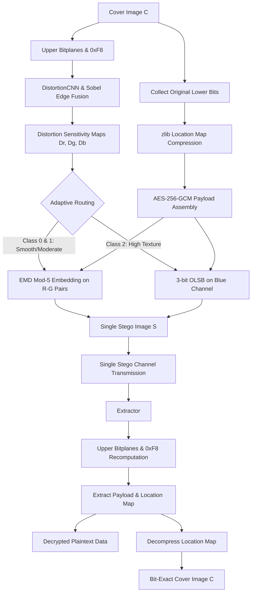

# CNN-Guided Distortion-Aware Adaptive EMD-OLSB Framework for Reversible Data Hiding in RGB Images

A Python research framework benchmarking **5 literature-derived RDH baselines** against a **proposed single-stego CNN-DA-EMD-OLSB** system for reversible data hiding in RGB images.

---

## 🌟 Key Features

1. **6-Model Comparative Benchmark Framework**:
   - **Model 1 — MPEH-RDH**: Multidirectional Prediction Error Histogram RDH
   - **Model 2 — MCSH-RDH**: Multi-Channel Synchronized Histogram RDH
   - **Model 3 — CNN-RDH Predictor**: PyTorch CNN Prediction Difference Histogram RDH
   - **Model 4 — SRDNN-Stego**: Super-Resolution Deep Neural Network Steganography (non-RDH baseline)
   - **Model 5 — EMD-OLSB RDH**: Literature Baseline Dual-Image Exploiting Modification Direction + OLSB
   - **Model 6 — CNN-DA-EMD-OLSB (Proposed)**: Single-Stego CNN-Guided Distortion-Aware Adaptive EMD-OLSB

2. **Proposed System: Single-Stego CNN-DA-EMD-OLSB**:
   - **Single Stego Image Transmission**: Transmits exactly **ONE** stego image $S$. Eliminates dual-image transmission overhead while achieving full reversibility.
   - **DistortionCNN**: Multi-scale 3-branch CNN computes per-channel distortion sensitivity maps $D_r, D_g, D_b$ exclusively from upper bitplanes (`& 0xF8`), ensuring perfect deterministic classification at the extractor.
   - **Adaptive Multi-Channel Routing**: Pixels classified into Class 0/1 (smooth/moderate texture: EMD on R-G channel pairs) or Class 2 (high texture: 3-bit OLSB on Blue channel).
   - **8-Block Boundary Safety**: Modulo-5 embedding modifications are constrained within the pixel's 8-block boundary, keeping upper bitplanes (`& 0xF8`) strictly invariant between cover and stego.
   - **Bit-Exact Reversible Recovery via Location Map**: Original lower bits of modified pixels are compressed via zlib and embedded within the payload. The extractor decompresses the location map to reconstruct the original cover image with zero error (`np.array_equal(cover, recovered_cover) == True`, `max_diff == 0`, `num_diff == 0`).
   - **AES-256-GCM Authenticated Encryption**: Cryptographically secure authenticated encryption with PBKDF2 key derivation and deterministic 64-byte binary header.

3. **Rigorous Research Integrity**:
   - Strictly **zero fabricated or hardcoded results** (PSNR, SSIM, MSE, BER, capacity, or p-values).
   - Genuine execution across all models: real PyTorch CNN inference, genuine AES encryption, genuine mod-5 EMD calculations, and real pixel-level metrics.
   - Transparent error handling: if payload exceeds image capacity, clear capacity limits are reported without silent data truncation.

4. **Interactive Streamlit Web Dashboard**:
   - **Home**: Architecture overview, theoretical formulation, and 6-model protocol comparison.
   - **Embed Payload**: Upload cover image, configure thresholds and parameters, embed payload, inspect difference maps, and download lossless PNG stego image.
   - **Extract Payload**: Upload single stego image, decrypt payload, and verify bit-exact cover reconstruction.
   - **Research Benchmark**: Run automated multi-model benchmarks on real images, generating comparative metrics (PSNR, SSIM, BPP, BER, Carrier Recovery %).
   - **Robustness Attacks**: Evaluate stego resilience against real-world channels (JPEG compression, Gaussian noise, salt-and-pepper noise, cropping, resizing).

---

## 🚀 Quick Start Guide

### 1. Install Dependencies
```bash
pip install -r requirements.txt
```

### 2. Launch Interactive Streamlit Web Application
```bash
streamlit run app.py
```

### 3. Run Automated Unit Test Suites
```bash
# Run all unit tests across the entire framework
python -m unittest discover -s tests -v

# Or run specific test modules
python -m unittest tests/test_6_models.py -v
python -m unittest tests/test_audit_fixes.py -v
python -m unittest tests/test_trained_pipeline.py -v
```

---

## 📁 Directory Architecture

```
CNN-DA-EMD-OLSB/
├── app.py                          # Streamlit Interactive Web Application
├── requirements.txt                # Python dependencies
├── README.md                       # Documentation and specifications
│
├── core/                           # Core RDH & Cryptographic Engines
│   ├── cnn_da_emd_olsb.py         # Proposed single-stego CNN-DA-EMD-OLSB engine
│   ├── encryption.py               # AES-256-GCM & PBKDF2 key derivation
│   ├── payload.py                  # 64-byte header packing, location map, zlib compression
│   └── metrics.py                  # PSNR, SSIM, MSE, BPP, BER quality calculations
│
├── cnn/                            # CNN Architecture & Training
│   ├── model.py                    # DistortionCNN re-export
│   ├── distortion_cnn.py          # Multi-scale 3-branch DistortionCNN PyTorch model
│   └── train_cnn.py                # CNN training script with edge & gradient loss
│
├── models/                         # 6 Research Model Implementations
│   ├── mpeh_rdh.py                 # Model 1: MPEH-RDH
│   ├── mcsh_rdh.py                 # Model 2: MCSH-RDH
│   ├── cnn_rdh.py                  # Model 3: CNN-RDH Predictor
│   ├── srdnn_stego.py              # Model 4: SRDNN-Stego (non-RDH baseline)
│   ├── emd_olsb.py                 # Model 5: Literature EMD-OLSB RDH (Dual-stego S1, S2)
│   ├── cnn_da_emd_olsb_model.py   # Model 6: Proposed CNN-DA-EMD-OLSB (Single-stego) wrapper
│   ├── distortion_cnn.pth          # Pretrained DistortionCNN weights
│   └── adapters.py                 # Standardized adapter framework for all 6 models
│
├── benchmark/                      # Comparative Benchmarking Engine
│   ├── runner.py                   # Automated 6-model comparative execution runner
│   ├── metrics.py                  # Standardized metric evaluators (PSNR, SSIM, BER, BPP)
│   └── experiments.py              # Multi-payload experiment and curve generator
│
├── experiments/                    # Channel Robustness Suite
│   └── attacks.py                  # Real JPEG, Gaussian noise, cropping, resize attacks
│
├── research/                       # Research Analysis & Paper Experiments
│   ├── payload_capacity.py         # BPP vs PSNR sweep curves
│   ├── security_analysis.py        # Chi-square, entropy, RS steganalysis
│   ├── steganalysis.py             # Feature extraction and classification resistance
│   ├── statistical_testing.py      # Friedman and Nemenyi post-hoc statistical tests
│   └── ui.py                       # Streamlit UI tab integrations for research suites
│
├── tests/                          # Automated Verification Suites
│   ├── test_6_models.py            # Baseline compatibility tests
│   ├── test_comprehensive.py       # Exact recovery, EMD mod-5, gamma fusion tests
│   ├── test_trained_pipeline.py    # Pretrained CNN weight pipeline verification
│   └── test_audit_fixes.py         # Research integrity and boundary safety tests
│
├── utils/                          # Image & Data Utility Functions
│   ├── image_utils.py              # Image loading, color conversions, synthetic patterns
│   └── payload_utils.py            # Bitstream conversion and padding helpers
│
└── results/                        # Output Artifacts
    ├── csv/                        # Generated benchmark metrics CSV files
    ├── graphs/                     # Publication figures and performance plots
    └── outputs/                    # Lossless stego output images
```

---

## 📊 Research Metrics Legend

| Metric | Full Name | Description & Theoretical Target |
| :--- | :--- | :--- |
| **PSNR** | Peak Signal-to-Noise Ratio | Perceptual visual quality in dB. Values $> 40\text{ dB}$ are considered visually transparent. |
| **SSIM** | Structural Similarity Index | Perceptual structural preservation ($1.0 = \text{identical}$ to human vision). |
| **MSE** | Mean Squared Error | Average squared pixel deviation between cover and stego ($0.0 = \text{identical}$). |
| **BPP** | Bits Per Pixel | Embedding payload capacity density: $\frac{\text{total embedded bits}}{H \times W}$. |
| **BER** | Bit Error Rate | Ratio of erroneous extracted bits ($0.0 = \text{lossless data recovery}$). |
| **Carrier Recovery** | Cover Image Reconstruction | Exact pixel recovery percentage ($100.0\% = \text{bit-exact cover restoration}$). |

---

## 🔬 Proposed Algorithm: CNN-DA-EMD-OLSB



### Embedding Pipeline
1. **Upper-Bitplane Feature Extraction**: Upper bitplanes (`cover & 0xF8`) are fed into `DistortionCNN` and blended with Sobel spatial gradients via $\gamma \cdot \text{CNN} + (1-\gamma) \cdot \text{Grad}$.
2. **Deterministic Classification**: Pixels are classified into Class 0 ($< t_1$), Class 1 ($t_1 \le D < t_2$), or Class 2 ($\ge t_2$). Because upper bitplanes are untouched during embedding, this classification is identical at embedder and extractor.
3. **Location Map Construction**: The original lower bits (bits 0..2) of all pixels scheduled for modification are collected and compressed using `zlib`.
4. **Authenticated Payload Packaging**: Plaintext data is compressed, encrypted via AES-256-GCM, packed with the compressed location map, and prepended with a 64-byte deterministic header.
5. **Boundary-Safe Modulo Embedding**:
   - Class 0 and Class 1 R-G pairs embed base-5 digits via $f(p_1, p_2) = (p_1 + 2p_2) \pmod 5$ with $+1/-4$ boundary clamping within the current 8-block.
   - Class 2 Blue pixels embed 3 bits via optimal LSB substitution.
6. **Output**: A single stego image $S$ is produced and saved losslessly.

### Extraction and Exact Recovery
1. **Recompute Capacity Maps**: Upper bitplanes (`stego & 0xF8`) yield identical distortion maps and pixel routing masks.
2. **Header Parsing**: 64-byte header is extracted to retrieve ciphertext length, location map size, and encryption parameters.
3. **Payload Extraction & Decryption**: EMD digits and OLSB bits are extracted from stego pixel values; AES-256-GCM decrypts the secret payload and verifies CRC32 integrity.
4. **Bit-Exact Cover Reconstruction**: Decompressed location map restores the original lower bits of every modified pixel, ensuring $100\%$ bit-exact carrier recovery.

---

## 🧪 Benchmark Protocol Comparison

| Model | Stego Image Count | Reversible Cover Recovery? | Distortion-Aware? | Deep Learning Guided? | Encryption |
| :--- | :---: | :---: | :---: | :---: | :---: |
| **Model 1 (MPEH-RDH)** | 1 | Yes (PEH histogram shifting) | No | No | No |
| **Model 2 (MCSH-RDH)** | 1 | Yes (Multi-channel histogram) | No | No | No |
| **Model 3 (CNN-RDH)** | 1 | Yes (CNN error histogram) | No | Yes (Predictor) | No |
| **Model 4 (SRDNN-Stego)** | 1 | No (Standard steganography) | Yes | Yes (Super-res) | No |
| **Model 5 (EMD-OLSB Baseline)** | 2 | Yes (Dual-image $(S_1+S_2)/2$) | No | No | No |
| **Model 6 (Proposed CNN-DA-EMD-OLSB)** | **1** | **Yes (Compressed Location Map)** | **Yes (Multi-scale)** | **Yes (DistortionCNN)** | **Yes (AES-256-GCM)** |
